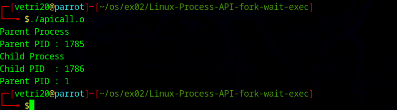
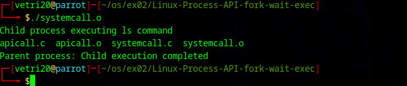

# Linux-Process-API-fork-wait-exec-
Ex02-Linux Process API-fork(), wait(), exec()
# Ex02-OS-Linux-Process API - fork(), wait(), exec()
Operating systems Lab exercise


# AIM:
To write C Program that uses Linux Process API - fork(), wait(), exec()

# DESIGN STEPS:

### Step 1:

Navigate to any Linux environment installed on the system or installed inside a virtual environment like virtual box/vmware or online linux JSLinux (https://bellard.org/jslinux/vm.html?url=alpine-x86.cfg&mem=192) or docker.

### Step 2:

Write the C Program using Linux Process API - fork(), wait(), exec()

### Step 3:

Test the C Program for the desired output. 

# PROGRAM:

## C Program to create new process using Linux API system calls fork() and getpid() , getppid() and to print process ID and parent Process ID using Linux API system calls

```
#include <stdio.h>
#include <unistd.h>

int main()
{
    pid_t pid;

    pid = fork();

    if (pid < 0)
    {
        printf("Fork failed\n");
    }
    else if (pid == 0)
    {
        // Child process
        printf("Child Process\n");
        printf("Child PID  : %d\n", getpid());
        printf("Parent PID : %d\n", getppid());
    }
    else
    {
        // Parent process
        printf("Parent Process\n");
        printf("Parent PID : %d\n", getpid());
    }

    return 0;
}
```


##OUTPUT




## C Program to execute Linux system commands using Linux API system calls exec() , exit() , wait() family


```
#include <stdio.h>
#include <unistd.h>
#include <sys/wait.h>
#include <stdlib.h>

int main()
{
    pid_t pid = fork();

    if (pid == 0)
    {
        printf("Child process executing ls command\n");
        execlp("ls", "ls", NULL);
        perror("Exec failed");
        exit(1);
    }
    else
    {
        wait(NULL);
        printf("Parent process: Child execution completed\n");
    }

    return 0;
}
```


##OUTPUT





# RESULT:
The programs are executed successfully.
